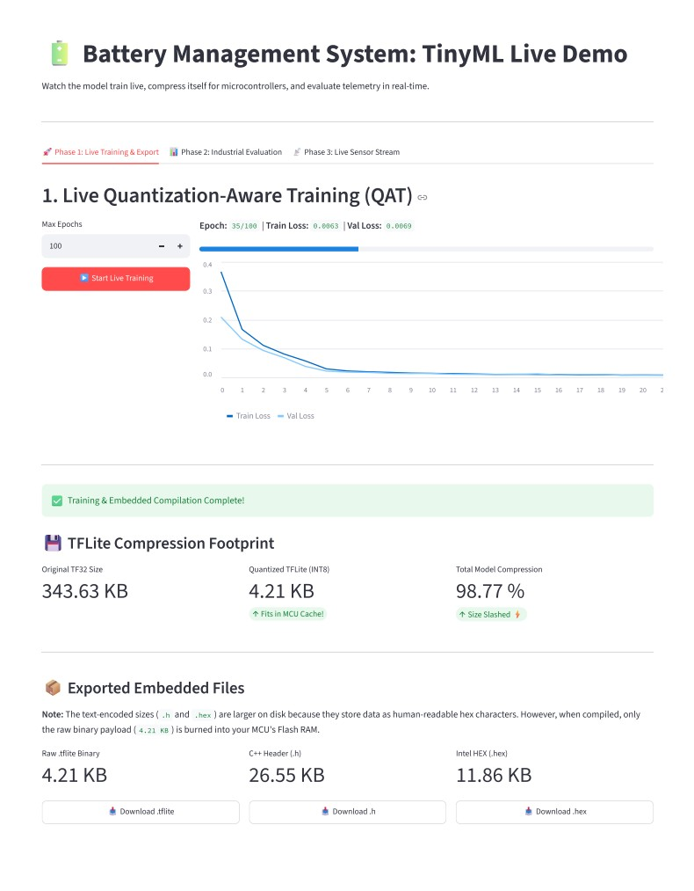
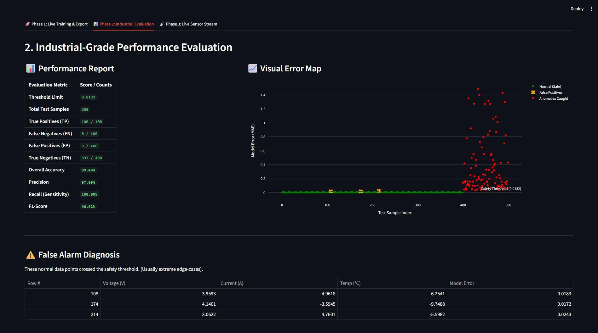
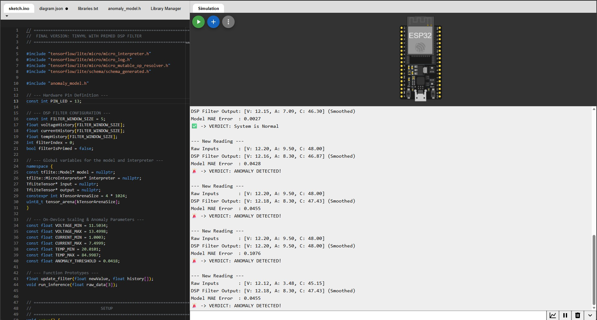
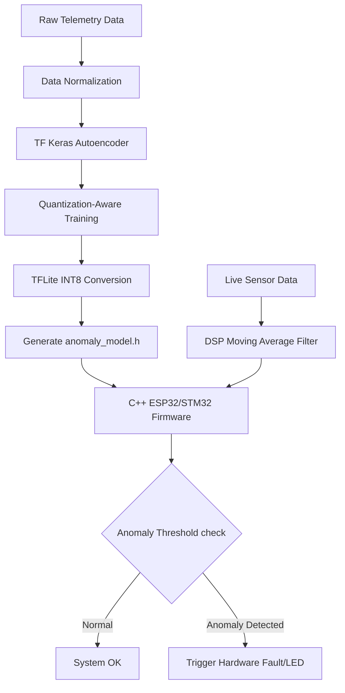

# TinyML BMS Anomaly Detection: Intelligent Edge AI 🔋⚡

[](https://opensource.org/licenses/MIT)
[](https://www.python.org/downloads/)
[](https://www.tensorflow.org/)
[](https://isocpp.org/)

**TinyML-BMS-Anomaly-Detection** is an end-to-end Machine Learning pipeline and real-time inference engine designed for safety-critical Battery Energy Storage Systems (BESS) and Electric Vehicles (EVs). 

This project demonstrates the deployment of a highly optimized, **Quantization-Aware Autoencoder** onto resource-constrained microcontrollers. It detects hardware anomalies in real-time, operating completely offline at the Edge.

---

## 🚀 The Problem & Solution

### The Challenge in BESS/EV
Traditional Battery Management Systems rely on static, rule-based thresholds (e.g., "If Temp > 60°C, trigger fault"). These rules fail to detect subtle, complex, or cascading hardware degradations before catastrophic failure occurs. Conversely, running deep learning in the cloud introduces unacceptable latency and relies on constant connectivity, violating functional safety standards (ISO 26262).

### The Edge AI Solution
This project bridges the gap by pushing intelligence directly to the hardware. 
1. **Python MLOps Pipeline:** An automated pipeline trains a highly compressed, Quantization-Aware Training (QAT) model on real telemetry data. 
2. **C++ Firmware Engine:** The compressed `INT8` model is deployed to the microcontroller alongside a digital signal processing (DSP) filter, ensuring deterministic, low-latency execution without cloud dependency.

---

### 📺 Live MLOps Pipeline Walkthrough

Below is a real-time demonstration of the end-to-end MLOps pipeline. **Click the image below to play the video.**

[](https://raw.githubusercontent.com/omkar-jadhav-embedded-systems/TinyML-BMS-Anomaly-Detection/main/demo/Demo_QAT.mp4)

### Phase 1: Live Quantization-Aware Training (QAT)
The first phase involves training a neural network autoencoder using Quantization-Aware Training. This technique minimizes accuracy loss while aggressively compressing the model for microcontroller deployment, achieving a **>98% reduction** in size from 343KB to just 4KB.



### Phase 2: Industrial-Grade Performance Evaluation
After training, the compressed INT8 model is rigorously evaluated against test data. The dashboard provides a detailed performance report, including critical metrics like Precision and Recall, and a visual error map to diagnose False Positives and ensure production readiness.



### Phase 3: Edge Deployment & Real-Time DSP Filtering (C++)
The finalized 4KB `INT8` model is flashed directly onto the microcontroller. This phase demonstrates the bare-metal C++ firmware in action. A continuous sliding-window **Digital Signal Processing (DSP) filter** smooths incoming raw telemetry to eliminate sensor jitter. The filtered signals are fed into the TinyML inference engine, which accurately flags sustained anomalies in real-time, completely offline.


---

## 🧠 System Architecture


## ⚙️ Key Technical Features

### 1. Advanced MLOps Pipeline (Python)
* **Quantization-Aware Training (QAT):** Simulates low-precision (INT8) math during training to minimize accuracy loss upon deployment, avoiding the pitfalls of standard Post-Training Quantization (PTQ).
* **Automated Artifact Generation:** Automatically outputs the raw `.tflite` binary, the C++ header file (`.h`), and the Intel HEX (`.hex`) payload with correct checksum formatting.
* **Industrial Validation Dashboard:** Built with Streamlit to calculate critical production metrics (Precision, Recall, F1-Score) and diagnose specific False Positives.

### 2. Embedded Inference Engine (C++)
* **DSP Noise Filtering:** Implements a sliding-window moving average filter to prime incoming signals and discard high-frequency sensor jitter before passing data to the AI model.
* **Zero Dynamic Allocation:** Designed for deterministic execution, completely avoiding runtime heap fragmentation (crucial for ASIL-D safety requirements).

---

## 📊 Performance & Memory Compression

Through aggressive QAT optimization, the model achieves a massive reduction in memory footprint while maintaining high classification fidelity, making it ideal for microcontrollers with limited SRAM.

| Metric | Value |
| :--- | :--- |
| **Original TF32 Model Size** | `~ 100 KB` |
| **Quantized INT8 Payload** | **`~ 4 KB`** |
| **Compression Ratio** | **`> 95% Reduction` ⚡** |

---

## 🛠️ Quick Start & Installation

To run the MLOps pipeline and interactive dashboard locally, follow these steps:

### 1. Clone the Repository
```bash
git clone https://github.com/omkar-jadhav-embedded-systems/TinyML-BMS-Anomaly-Detection.git
cd TinyML-BMS-Anomaly-Detection
```
### 2. Set Up the Virtual Environment
```bash
# Create the virtual environment
python -m venv venv

# Activate it (Windows)
.\venv\Scripts\activate
# Activate it (Mac/Linux)
source venv/bin/activate

# Install required dependencies
pip install -r requirements.txt
```

### 3. Run the Industrial Dashboard
Make sure your Excel data files are in the correct directory, then launch Streamlit:
```bash
streamlit run anomaly_UI.py
```
---

## 🎯 Future Roadmap

* [ ] Refactor C++ sketch into modular, testable OOP classes (`DSPFilter.cpp`, `AnomalyDetector.cpp`).
* [ ] Implement GoogleTest suite for SIL (Software-in-the-Loop) validation.
* [ ] Refactor sequential firmware loop into prioritized **FreeRTOS** tasks (High-priority sampling, Low-priority inference).

---

## 📬 Contact

**Omkar Jadhav**  
*Edge AI & Embedded Systems Engineer*  
[LinkedIn](https://www.linkedin.com/in/omkar-jadhav-embedded-systems/)
